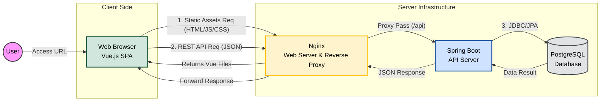

+++
title = '[게시판] README.md'
date = 2026-02-05
featured_image = "https://upload.wikimedia.org/wikipedia/commons/thumb/7/79/Spring_Boot.svg/330px-Spring_Boot.svg.png"
tags = ['skala','springboot','board']
+++



 

## 1. 프로젝트 소개

- Spring boot를 사용해 게시판 만들기
- 기본 CRUD 기능 구현
- 로그인 기능 구현 (`Oauth` 등)
- H2 DB로 개발 → 도커로 외부 DB와 연결

 
 
 

## 2. 아키텍쳐

- 
- 
- 
- 

Mermaid

 
 
 

## 3. ERD 설계

- **핵심 엔티티**
    - `USERS`: 시스템의 주체
    - `CATEGORIES`: 게시글이 속하는 분류
    - `POSTS`: 사용자가 특정 카테고리에 작성하는 본문
- **소셜 및 상호작용 엔티티**
    - `POST_LIKES`: 사용자가 게시글을 좋아요를 누를 수 있음
    - `POST_FAVORITES`: 사용자가 게시글을 보관함에 저장
    - `CATEGORY_FAVORITES`: 사용자가 특정 카테고리를 구독하거나 즐겨찾기
    - `FOLLOWS`: 사용자 간의 관계
- **데이터 무결성**
    - `ON DELETE CASCADE`: 모든 연결 테이블(댓글, 좋아요, 팔로우 등)에 적용
    - 사용자를 삭제하면 그 사람이 쓴 글, 댓글, 좋아요 기록이 자동으로 모두 삭제

 
 
 

## 4. 개발 문서 정리

- [`README.md` >>]()
- [기능 요구사항 명세서 >>]()
- [REST API 명세서 >>]()
- [트러블 슈팅 기록 >>]()
- [학습 기록 >>]()

 
 
 



 
 
 
